### Netflix 사용자 EDA 분석

# **🍿 신규 OTT 서비스 전략 분석 프로젝트**

## **👨‍👩‍👧‍👦 팀 소개(What’s your OTT?)**

5팀 프로젝트: 

신규 OTT서비스 런칭을 가정하고, 시장 경쟁사인 넷플릭스의 사용자 데이터를 사용해 인사이트를 도출했습니다. 이 프로젝트는 넷플릭스 구독자 연령대별, 국가별, 장르별 등으로 분석하고 및 시각화 자료를 제공합니다.

### **팀원소개 및 역할분담**
- 승철님 : 넷플릭스 데이터 수집 및 국가별 서비스 확장 전략 수립
- 정규님 : 연령대별/국가별/장르별 데이터 분석
- 유나님 : 구독 요금제의 특징과 타 관계성에 대한 데이터 분석
- 은선님: 구독자 중 잠재적 이탈자에 관한 데이터 분석
- 유진님: 연령대별/국가별/장르별 데이터 분석

## 🙋 문제 제기

1. 프리미엄 요금제의 수익성 문제: 가장 높은 요금임에도 시청 시간이 기대보다 낮고 이탈률이 높아 수익성 개선이 필요함
2. 요금제별 차별화 부족: Premium-Standard-Basic으로 구분된 피라미드형 요금제가 실제로 각 등급별 충분한 가치 차별화를 제공하지 못하고 있음
3. 사용자 이탈 위험: 낮은 시청 시간(30시간 미만), 장기 미접속, 특히 프리미엄 구독자의 미활성 문제가 심각함

## 📌 분석 목적

넷플릭스 사용자 데이터(국가, 연령, 요금제, 장르 등)를 기반으로 고객 특성과 행동 패턴을 파악하고, 우리만의 OTT 차별화 전략을 제안합니다.

---

## 📊 데이터 소개

### Netflix User Dataset

**Origjnal Data**

|  | User\_ID | Name | Age | Country | Subscription\_Type | Watch\_Time\_Hours | Favorite\_Genre | Last\_Login |
| --- | --- | --- | --- | --- | --- | --- | --- | --- |
| 0 | 1 | James Martinez | 18 | France | Premium | 80.26 | Drama | 2024-05-12 |
| 1 | 2 | John Miller | 23 | USA | Premium | 321.75 | Sci-Fi | 2025-02-05 |
| 2 | 3 | Emma Davis | 60 | UK | Basic | 35.89 | Comedy | 2025-01-24 |
| 3 | 4 | Emma Miller | 44 | USA | Premium | 261.56 | Documentary | 2024-03-25 |
| 4 | 5 | Jane Smith | 68 | USA | Standard | 909.3 | Drama | 2025-01-14 |

**Scaling 및 Feature Engineering**

| Age\_cat | Day\_Name | Day\_Type | Recent\_Login |
| --- | --- | --- | --- |
| Teenager | Sunday | Weekend | 369 |
| Young Adult | Wednesday | Weekday | 100 |
| Adult | Friday | Weekday | 112 |
| Adult | Monday | Weekday | 417 |
| Senior | Tuesday | Weekday | 122 |

---
## 🎬 1. 컨텐츠 기획 전략

### 1-1. 선호 장르별 평균 시청시간

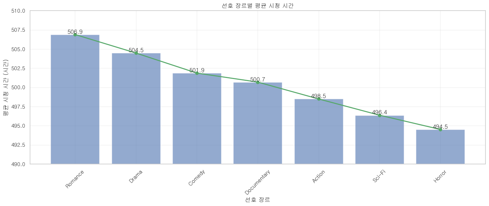

- 로맨스, 드라마, 코미디 순으로 시청 시간 높음
- SF, 호러 등은 상대적으로 낮음
    
    → **감정 몰입형 콘텐츠**에 대한 수요 높음
    

### 1-2. 연령대별 평균 시청시간

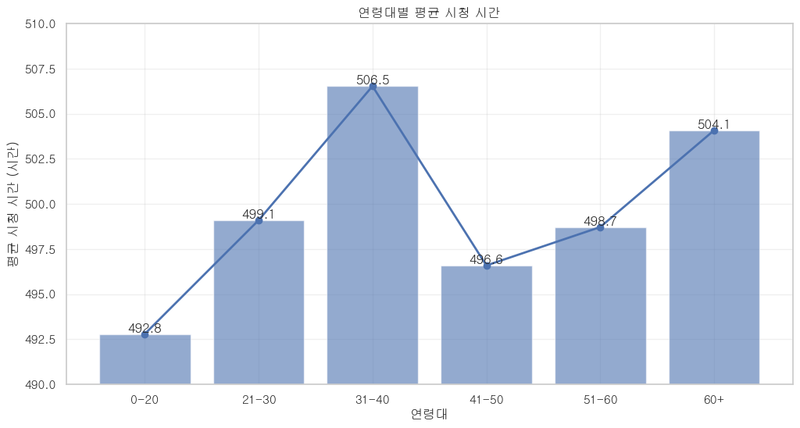

- 31~40세 그룹이 가장 높은 시청시간
- 60대 이상에서도 다시 상승 추세
    
    → **중장년층 대상 콘텐츠 확장 가능성**
    

### 1-3. 장르별 시청시간 이상치 분포

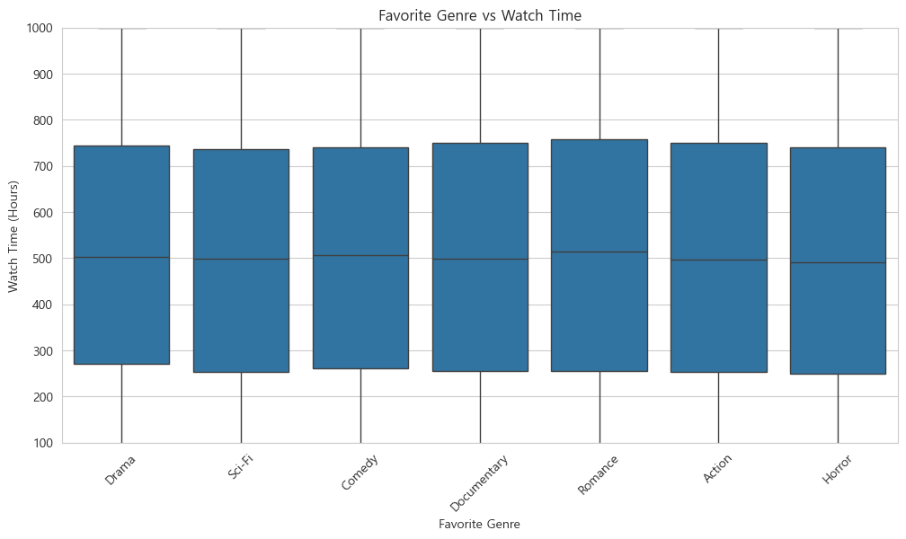

- 장르별 시청시간 분포에 이상치 거의 없고 안정적
    
    → 일정한 패턴으로 고르게 소비
    

### **🔥 Key Insights:**

1. 로맨스, 드라마, 코미디와 같은 **감정 몰입형 중심 컨텐츠** 제작
2. **중장년층 대상 컨텐츠**로 확장

---

## 🌐 2. 글로벌 진출 전략

### 2-1. 국가별 평균 시청시간

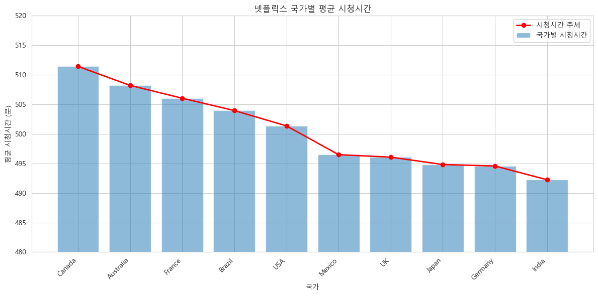

- 캐나다, 호주, 프랑스 > 인도, 일본
    
    → **고시청 국가 타깃 콘텐츠 집중 제작 필요**
    

### 2-2. 국가별 선호 장르

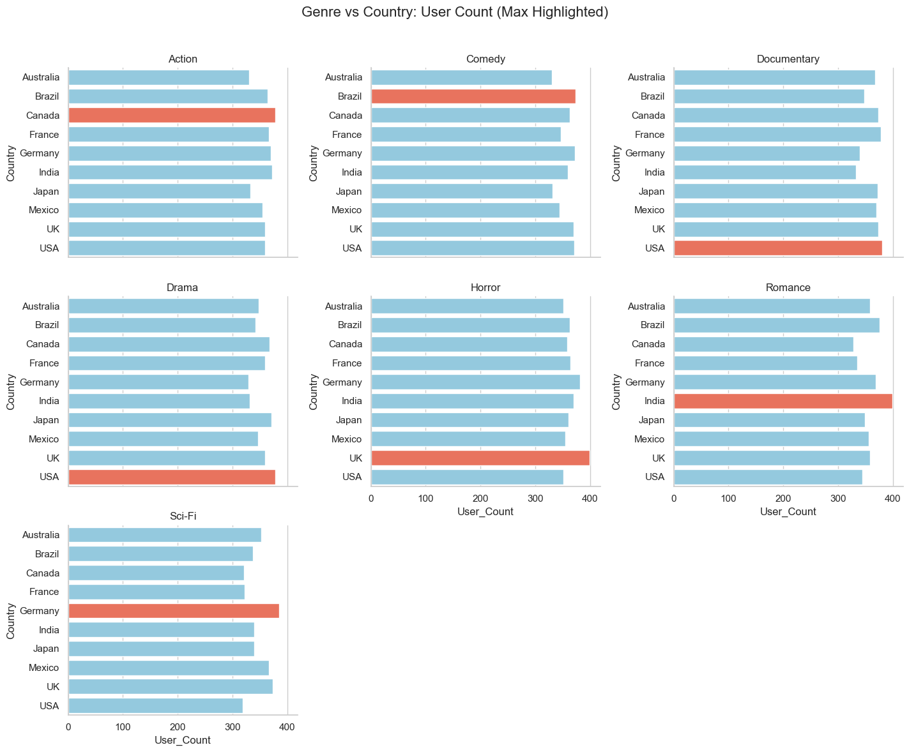

- 인도: 로맨스 / 미국: 드라마 / 독일: SF / 브라질: 코미디
    
    → **국가별 맞춤 장르 콘텐츠 전략 필수**
    

### **🔥 Key Insights:**

1. **높은 시청기록 국가(캐나다, 호주, 프랑스) 컨텐츠** 집중 제작
2. 인도: 로맨스, 미국: 드라마와 같이 **국가별 선호 장르를 고려한 현지화** 전략

---

## 💸  3. 요금제 리디자인 전략

### 3-1. 요금제별 평균 시청 시간

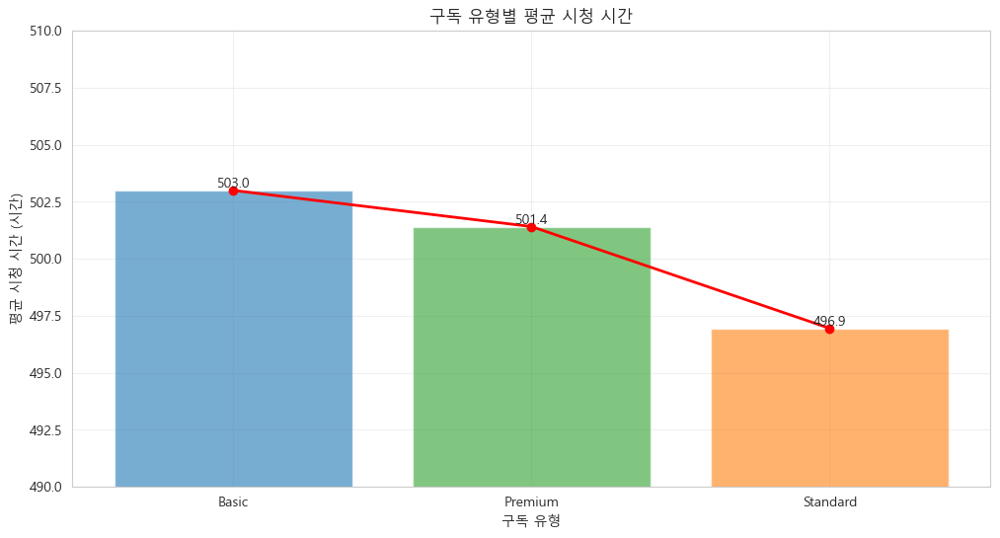

- Premium 요금제 시청 시간이 오히려 낮음
    
    → 고가 요금제에 대한 **콘텐츠 유인 강화 필요**
    

### 3-2. 국가별 구독유형 분포

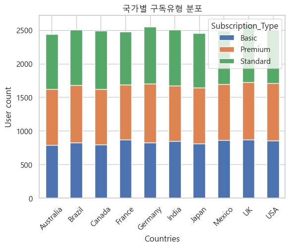

- 국가마다 요금제 분포도 일정 (문화/소득 영향)
    
    → **국가별 요금제 다각화 고려**
    

### 3-3. 구독유형별 선호 장르

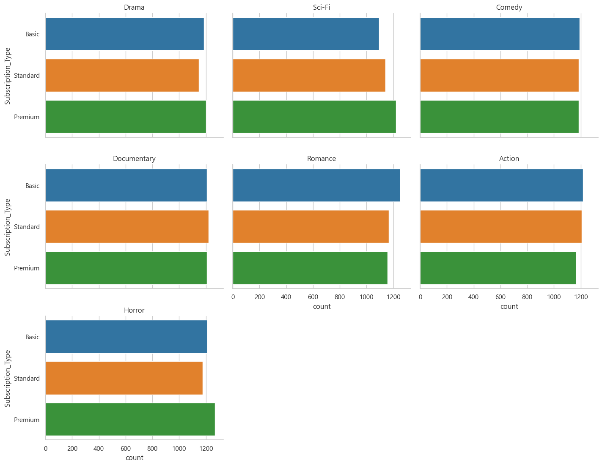

| **구독 유형** | **선호 장르 1** | **선호 장르 2** | **선호 장르 3** |
| --- | --- | --- | --- |
| Premium | Action (35%) | Documentary (25%) | Thriller (20%) |
| Standard | Drama (30%) | Comedy (25%) | Action (20%) |
| Basic | Drama (40%) | Comedy (30%) | Romance (15%) |

• Basic: 로맨스, Standard: 드라마, Premium: SF, 호러

→ **프리미엄 고객 대상 전용 콘텐츠 개발 고려**

### 3-4. 요일별 사용자 로그인 패턴

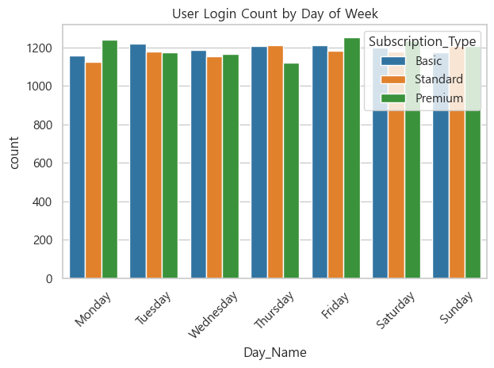

- 프리미엄 사용자는 월요일 활동 높음
    
    → **평일 집중형 콘텐츠 기획 가능**
    

### 3-5. 주중/주말 이용 비율

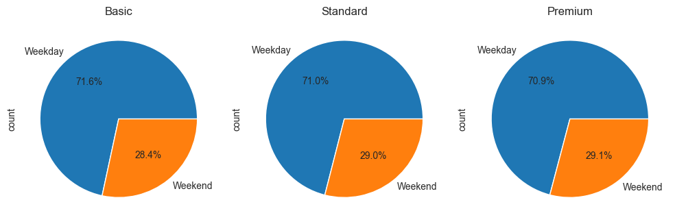

- 전체 요금제에서 주중 시청 비율이 압도적 (70% 이상)
    
    → **OTT 이용이 일상이 평일에도 높고 루틴화됨**
    

### 3-6. 상위 10% 시청자 요금제 비율

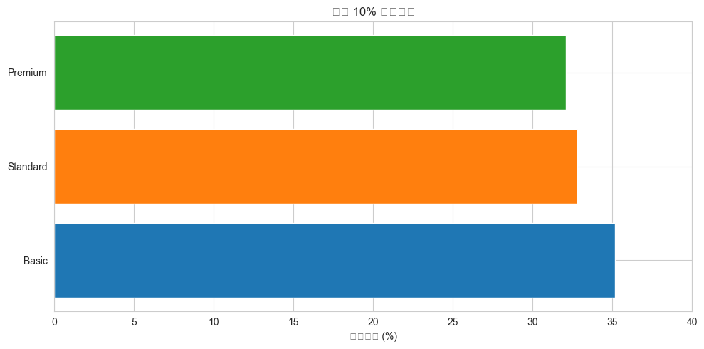

- 시청량 상위 그룹은 대부분 **Basic 사용자**
    
    → 요금제와 실제 콘텐츠 소비 간 **비대칭 존재**
    

### **🔥 Key Insights:**

1. Premium 사용자의 평균 시청 시간이 낮고, 상위 10%의 시청자 대부분은 오히려 Basic 이용자, **콘텐츠 소비와 요금제가 불일치**
2. 주중 이용 비율이 높고, Premium 사용자는 월요일 집중으로 **Premium 평일 전용 컨텐츠** 제공, **국가별 맞춤형 가격** 전략

---

## 🚀 4. 고객 유지 전략

### 4-1. 구독유형별 잠재적 이탈자 비율

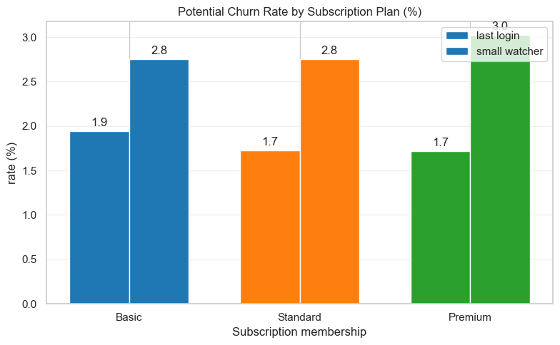

- Basic > Premium 순으로 이탈자 비율 존재
    
    → **이탈 방지 맞춤 프로모션 설계 필요**
    

### 4-2. 국가별 잠재적 이탈자 비율

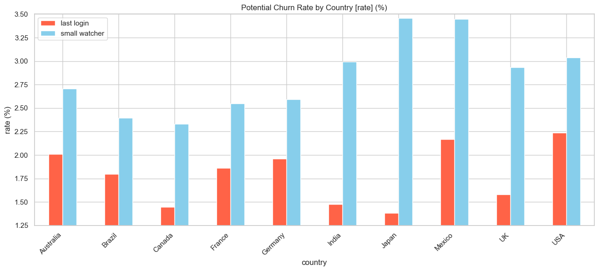

- 일본: 시청시간은 낮지만 로그인 지속
- 미국/인도/멕시코: 이탈 가능성 높음
    
    → **국가별 집중 전략 필요**
    

### **🔥 Key Insights:**

고객 확보 전략

1. 이탈 방지 맞춤 프로모션 설계
    1. **구독자 관리 프로그램** → 로그인 주기 마케팅: **로그인 주기 예측** 기반 (푸시알림)
2. 국가별 집중 전략 → 핵심 차별화 전략 : **시즈널 컨텐츠** 전략

---

## **🎯 핵심 차별화 전략 : 시즈널 콘텐츠 제작**

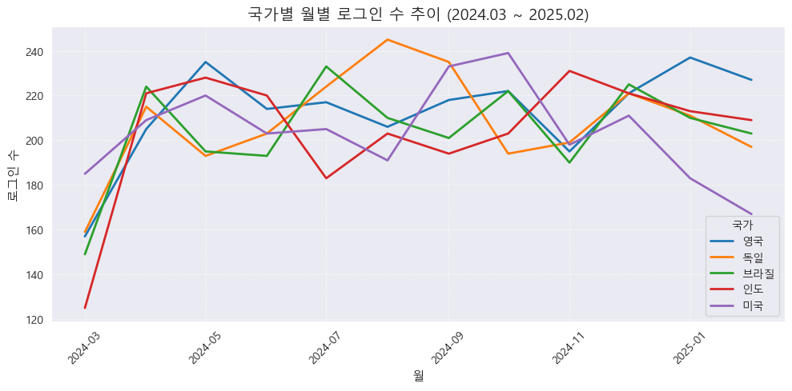

- **미국** : 로그인 수가 모든 월에서 가장 많음. 월별 변동폭이 작고 일정한 수준 유지. 플랫폼 이용 습관이 고정되어 있음
- **영국/독일** : 계절 패턴이 뚜렷. 겨울 집중형 전략 적합 , 10~12월 로그인 수가 뚜렷하게 상승→ 겨울 시즌에 콘텐츠 관심도 집중(휴가시즌)
- **인도/브라질** : 월별 기복이 크고, 특정 달에 급증. 브라질은 7월 등 특정 달에 갑자기 상승. 인도는 10월에 최고점 → 신작 콘텐츠의 공개 등으로 추정 (예: 국가별 독자적 컨텐츠 릴리즈)

### **🔥 Key Insights:**

국가별 주요 휴가 시즌에 시청 시간 증가하고, 타겟팅 시즌 특화 프로모션 연계 → **국가별 독점** **시즌별 컨텐츠**를 제공

## **📈** 결론 : 전략 요약

| 전략 항목         | 전략 제안 |
|------------------|-----------|
| 콘텐츠 기획       | 감성 몰입형 장르 강화 (로맨스, 드라마) 중장년층 콘텐츠 확장 |
| 글로벌 진출       | 국가별 맞춤 장르 제작 및 독점 콘텐츠 운영 |
| 요금제 리디자인   | - Premium 차별화: Premium 평일 전용 콘텐츠 제공 - 국가별 맞춤형 가격 전략 |
| 고객 유지         | - 로그인 주기 마케팅: 로그인 주기 예측 기반 (푸시알림) - 시즈널 콘텐츠 전략 |
| 시즈널 콘텐츠     | - 국가별 주요 휴가 시즌에 맞춰 국가별 독점 시즈널 콘텐츠 제공 |

---

## 🪞 한 줄 회고 🧠💬 

* 승철님 : 다음부턴 프로젝트에 설레여 보고 싶다. 
* 정규님 : 데이터 분석에 대해 기초체력을 길러볼수있는 좋은 경험이되었습니다 팀원보두 고생하셨습니다 !
* 유나님 : 팀원들과 함께 데이터를 선정하고 서로가 분석한 내용을 바탕으로 서로 논의할 때 가장 즐거웠어요 고생많으셨습니다! 
* 은선님: 수업시간에 배운 내용을 토대로 프로젝트를 하면서 배운 내용이 정리되는 느낌이었습니다. 팀원 모두 수고하셨습니다!
* 유진님: 데이터 탐색 및 분석에 대해 실습하고 논의하는 과정이 좋은 경험이었습니다.

